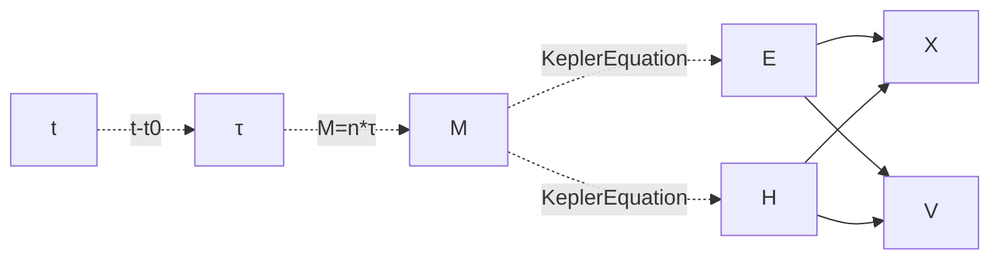
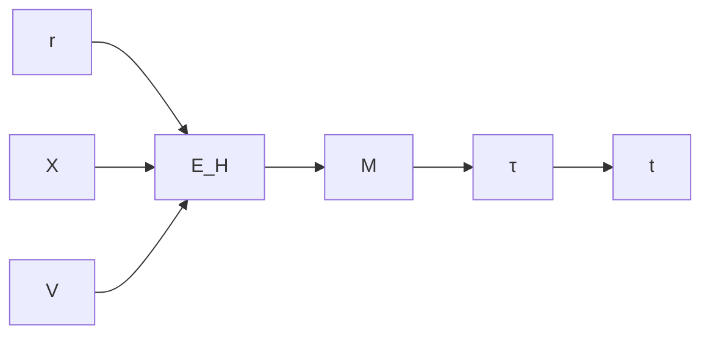

# 项目介绍：限制性多体模拟

考虑大部分物体都是小质量物体的情形（类似于稳定的恒星系统），在多体模拟中，可以将整个系统划分成多个引力区域，通过二体问题的求解来模拟物体运动。

二体问题是为数不多的能被求解的复杂运动，二体问题的运动微分并不复杂，即最为经典的万有引力公式，在忽略小质量物体的质量后，可以写作
$$
\ddot{x}=-\frac{\mu}{\|x\|^3}x
$$
使用迭代计算计算此算式的计算量并不大，但迭代计算最大的问题的运动趋于发散，或是说迭代过程中物体的能量不守恒。当然这可以通过更好的迭代方法缓解。但对于二体问题，其是可以通过运动方程的求解计算其精确解。这意味这物体的运动状态可以被转化为静态参数，通过时间来确定物体的运动矢量（位移与速度）

不过通过方程求解的过程中也存在诸多问题，尤其是方程求解过程中产生分支的情形，这个项目主要是测试二体问题是否能在GPU上被高效求解，以及是否能通过插值的方式使得方程求解的性能优于迭代求解

# 轨道力学部分

## 轨道参数到状态矢量

将轨道参数转换为物体的位移与速度

### 开普勒六参数

1. a 半长轴 semi-major axis 
2. e 偏心率 eccentricity 
3. i 仰角 inclination
4. Ω 赤径 longitude of ascending node
5. ω 近心点幅角 Argument of periapsis
6. υ 真近点角 True anomaly


### 计算中使用的角

在计算之中不会直接计算真近点角

而是计算偏近点角E，E与平近角M有如下关系。且M与时间的关系为线性关系
$$
开普勒方程\\
M=E-e \sin E\\
时间与平近角\\
M=n*\tau
$$
其中n是平均角速度、τ是固有时间


如下定义轨道参数

```python
@ti.dataclass
class Orbit:
    a: ti.f32
    e: ti.f32
    i: ti.f32
    w: ti.f32
    W: ti.f32
    n: ti.f32
    t: ti.f32
    t0: ti.f32
    M: ti.f32
    rotation: ti.math.mat3
```

### 计算的流程



#### 开普勒方程的求解

一般来说开普勒方程指的是椭圆轨道下的
$$
开普勒方程\\
M=E-e \sin E\\
$$
美国海军天文台 `Marc A. Murison`  [A Practical Method for Solving the Kepler Equation](https://www.researchgate.net/publication/271214938_A_Practical_Method_for_Solving_the_Kepler_Equation) 

使用三阶迭代方程计算椭圆轨道的开普勒方程

推导过程

将其写成方程形式，当$x=0$时即 $x=E$
$$
f(x)=x−esinx−M
$$
误差值$ε≡x−E$则有 $E=x-\epsilon$

泰勒展开
$$
f(E)=f(x−ε)=x−esinx−M−(1 −ecosx)ε+\frac{1}{2}ε^2esinx−\frac{1}{6}ε^3ecosx+...
$$
取一阶项 $0=x−esinx−M−(1 −ecosx)ε$有
$$
\varepsilon=\frac{x-e \sin x-M}{1-e \cos x}
$$


误差值写成迭代式
$$
\varepsilon_{n+1}=\frac{x_{n}-e \sin x_{n}-M}{1-e \cos x_{n}}
$$
二阶项 $x−esinx−M−(1 −ecosx)ε+\frac{1}{2}ε^2esinx$ 
$$
\varepsilon=\frac{x-e \sin x-M}{1-e \cos x-\frac{1}{2} \varepsilon e \sin x}\\
\varepsilon_{n+1}=\frac{x_{n}-e \sin x_{n}-M}{1-e \cos x_{n}-\frac{1}{2} \varepsilon_{n} e \sin x_{n}}\\
$$
将一阶误差值带入
$$
\varepsilon_{n+1}=\frac{x_{n}-e \sin x_{n}-M}{1-e \cos x_{n}-\frac{1}{2} e \sin x_{n} \frac{x_{n}-e \sin x_{n}-M}{1-e \cos x_{n}}}
$$
三阶项$x−esinx−M−(1 −ecosx)ε+\frac{1}{2}ε^2esinx−\frac{1}{6}ε^3ecosx$转换带入二阶误差值迭代式，最终有
$$
\varepsilon_{n+1}=\frac{x_{n}-e \sin x_{n}-M}{1-e \cos x_{n}-\frac{1}{2}\left(e \sin x_{n}-\frac{1}{3} e \cos x_{n} \cdot \varepsilon_{n}\right) \varepsilon_{n}}
$$

##### 初始值的设置

$$
E_{k}=M+e \sin E_{k-1}
$$

三阶迭代后，初始值已经与收敛值接近，初始迭代值 $E_0=M$
$$
E=M+e \sin M+e^{2} \sin M \cos M+\frac{1}{2} e^{3} \sin M\left(3 \cos ^{2} M-1\right)
$$


初始值的差值

当离心率接近于1时会有较大的误差

##### 总结上述的方法

$$
f^{(0)} = f(x)\\
\epsilon_1 = \frac{f^{(0)}}{f^{(1)}}\\
\epsilon_2 = \frac{
f^{(0)}
}{
f^{(1)}-\epsilon_1\frac{f^{(2)}}{2}
}\\
\epsilon_3 = \frac{
f^{(0)}
}{
f^{(1)}-\frac{f^{(2)}-\epsilon_2\frac{f^{(3)}}{3}}{2}
}\\
$$

写成递归形式
$$
\epsilon_1 = \frac{f^{(0)}}{f^{(1)}}\\
f^{(n)}=f^{(n)}-\epsilon_n\frac{f^{(n+1)}}{n+1}\\
$$


#### 双曲轨道的开普勒方程

$$
M=e \sinh H-H
$$

H为双曲角 $H=iE$ 且有 $\sinh(ix)=-i\sin(x)$
$$
M=i e \sin E-i E=-i(E-e \sin E)
$$
双曲轨道与椭圆轨道的开普勒函数在某种意义上来说是统一的，但是这里还是单独计算双曲轨道的开普勒方程

将其写成方程
$$
f(x)=e \sinh x-x-M
$$
求导展开带入上述方法即可得到解

##### 初值

但是很遗憾的是迭代的初值方法对于双曲轨道并不适用，其会导致数值发散，所以，这里采用了比较简陋的方法，采用$\arcsin(M)$作为迭代初值


基准值


初始值的差值

此方法并没有进行验证，双曲线下的迭代次数不一定为最优

#### 确定初值：查表法

进行预计算，将计算结果提前储存在一张贴图中，后续通过查表插值来得到较为接近的初值

对于椭圆轨道，可以进行周期映射，将$E$的范围映射到$[-\pi,\pi)$的区间内进行插值

对于双曲轨道，M与e均不存在周期，且可以延伸到无限远处，考虑将 $e\in(1,+\inf) \rightarrow \frac{1}{e}\in(0,1)$，对H的计算范围加以限制，超出范围的M值取$\arcsin(M)$

并且考虑到开普勒方程的对称性，预计算结果中只需要存储M>0或者M<0的结果

### 位移与速度求解

这里不采用圆锥曲线的统一方程，因为在偏心率趋近于1时（低速状态下）会导致数值发散

#### 椭圆轨道

平面位移
$$
r=a(1-e\cos E)\\
\vec{X}=\begin{bmatrix}a\cos E -c\\
b\sin E\\
0
\end{bmatrix}
$$
平面速度
$$
v=\sqrt{MG(\frac{2}{r}-\frac{1}{a})}\\
\vec{V}= \left \| \begin{bmatrix}
-a\sin E\\
b\cos E\\
0
\end{bmatrix} \right \|\cdot v
$$

#### 双曲轨道

为区分两种轨道、减少分支，双曲轨道的半长轴为负数即 $a<0$

平面位移
$$
r=a(1-e\cosh H)\\
\vec{X}=\begin{bmatrix}
a\cosh H -c\\
-b\sin E\\
0
\end{bmatrix}
$$
平面速度
$$
v=\sqrt{MG(\frac{2}{r}-\frac{1}{a})}\\
\vec{V}= \left \| \begin{bmatrix}
a\sinh E\\
-b\cosh E\\
0
\end{bmatrix} \right \| \cdot v
$$

### 平面到空间的转化

R是 i 仰角 Ω 赤径 ω 近心点幅角的旋转矩阵
$$
\vec{X_w} = R\cdot\vec{X}\\
\vec{V_w} = R\cdot\vec{V}\\
$$
其中旋转的计算方法

```python
R = ti.math.rotation3d(0.0, 0.0, W)@ti.math.rotation3d(i, 0.0, 0.0)@ti.math.rotation3d(0.0, 0.0, w)
```


## 状态矢量到轨道参数

$$
\mu=MG\\
Ws=\frac{\vec{V}^2 }{2}-\frac{\mu}{\left | \vec{X} \right | }  \\
a=-\frac{\mu}{2W_s} \\
\vec{L} =\vec{X}\times \vec{V}  \\
p=\frac{\vec{L}^2 }{\mu} \\
e=\sqrt[]{1-\frac{p }{a} } 
$$

### 平近角

对于椭圆轨道
$$
\cos E=1-\frac{r}{a}\\
\sin E =\frac{\vec{X}\cdot \vec{V} }{\sqrt[]{a\mu } }\\
M=E-e\sin E
$$
对于双曲轨道
$$
\cosh H = \frac{1+\frac{r}{a} }{e}\\
\sinh H=\frac{\vec{X}\cdot \vec{V} }{e\sqrt[]{-a\mu } }\\
M=e\sinh H-H
$$

### 仰角

$$
\sin i=\frac{\left | \vec{L_{xy}}   \right | }{\left | \vec{L_{}}   \right |}\\
\cos i=\frac{L_z}{\left | \vec{L}  \right | } 
$$

### 真近角

$$
\tan \theta =\frac{\sqrt[]{1-e^2 }\sin E}{\cos E-e} \\
\tan \theta =-\frac{\sqrt[]{e^2-1 }\sinh H}{\cosh H-e}
$$

## 关系图


从M转换到E或H需要求解开普勒方程，开销高。但是逆向求解的开销并不高




