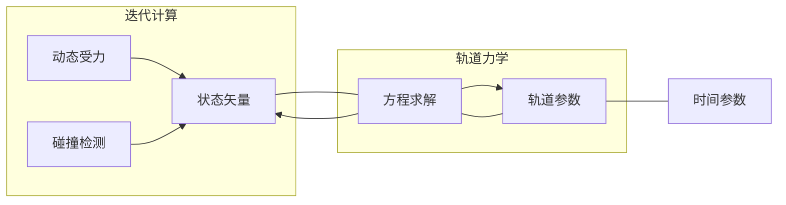
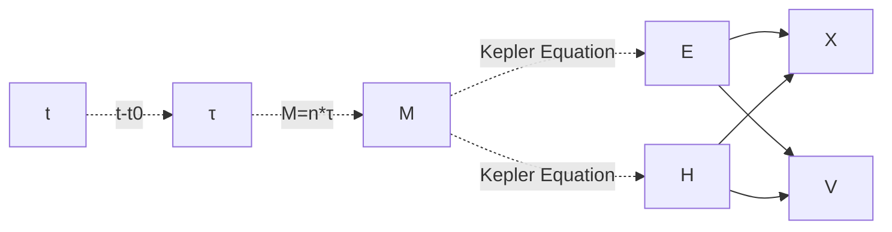
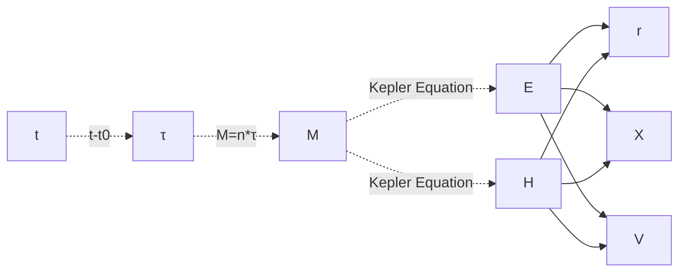
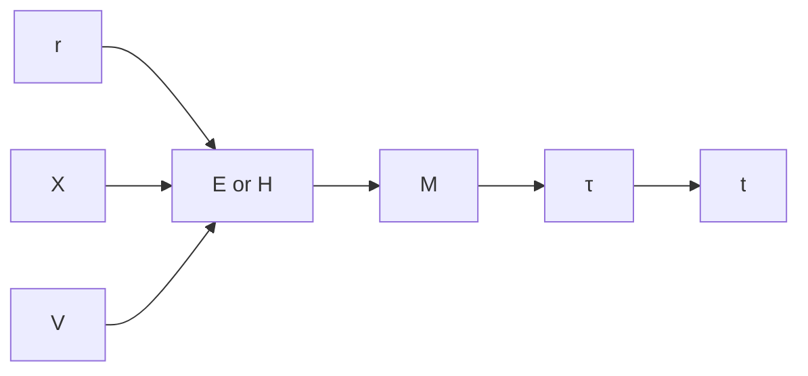

# Restricted Gravity Simulation


## [为更好的阅读体验在此阅读](https://stellarwarp.github.io/posts/OrbitEquation/)

# 介绍

考虑大部分物体都是小质量物体的情形（类似于稳定的恒星系统），在多体模拟中，可以将整个系统划分成多个引力区域，通过二体问题的求解来模拟物体运动。

二体问题是为数不多的能被求解的复杂运动，二体问题的运动微分并不复杂，即最为经典的万有引力公式，在忽略小质量物体的质量后，可以写作

$$
\ddot{x}=-\frac{\mu}{\|x\|^3}x
$$

使用迭代计算计算此算式的计算量并不大，但迭代计算最大的问题的运动趋于发散，或是说迭代过程中物体的能量不守恒。当然这可以通过更好的迭代方法缓解。但对于二体问题，其是可以通过运动方程的求解计算其精确解。这意味这物体的运动状态可以被转化为静态参数，通过时间来确定物体的运动矢量（位移与速度）

不过通过方程求解的过程中也存在诸多问题，尤其是方程求解过程中产生分支的情形，这个项目主要是测试二体问题是否能在GPU上被高效求解，以及是否能通过插值的方式使得方程求解的性能优于迭代求解


在这个模型中，大部分物体都是小质量物体，其质量可以被忽略，

使用方程求解运动，将静态参数与运动矢量相互转换，以达到物体互动的效果



项目地址：

https://github.com/StellarWarp/RestrictedGravitySimulation

## 引力范围

为了能与不同的天体产生互动，同时仍不引入多体引力，整个引力系统被划分为多个引力范围。比如一个恒星与一个行星，物体以最小的引力范围为中心环行。


如何定义引力范围的大小？一般来说，当中心天体对物体的摄动大于其卫星时，可以认为卫星的引力已经可以被忽略

卫星轨道偏心率为0的情形下，引力范围（Sphere Of Influence）可以使用如下的公式计算


$$
r_{SOI}=R(\frac{m_p}{m_s})^{2/5}
$$

可以使用碰撞检测的方法来确定物体是否离或进入引力范围


# 轨道力学部分

## 轨道参数到状态矢量

这一部分内容讲述如何，将轨道参数转换为物体的位移与速度，即从时间参数转换为物体的位置与速度

### 开普勒六参数

轨道参数一般使用开普勒六参数来描述，开普勒六参数包括

1. $a$ 半长轴 semi-major axis 
2. $e$ 偏心率 eccentricity 
3. $i$ 仰角 inclination
4. $\Omega$ 赤径 longitude of ascending node
5. $\omega$ 近心点幅角 Argument of periapsis
6. $\upsilon$ 真近点角 True anomaly


我们需要解决两个问题
1. 将轨道参数转换为物体的位移与速度
2. 将时间转化为轨道参数

给定轨道参数，求解物体的位置与速度是一个简单的几何问题

### 位移与速度求解

#### 圆锥曲线方程

快速回顾一下椭圆与双曲线的几何性质

<figure>


<figure>


在椭圆中有

$$
\begin{align*}
c^2&=a^2-b^2\\
\end{align*}
$$

在双曲线中有

$$
\begin{align*}
c^2&=a^2+b^2\\
\end{align*}
$$

离心率的定义为

$$
e=\frac{c}{a}
$$

圆锥曲线的统一方程为

$$
r=\frac{p}{1+e\cos \theta}
$$

其中

$$
\begin{align*}
p&=a(1-e^2)\\
\end{align*}
$$

这个方程可以表示圆、椭圆、双曲线、抛物线，虽然其在数学上有很好的一致性，但是在计算上会出现一些问题，当$e=1$时，分母为0，无法计算

这里不采用圆锥曲线的统一方程，因为在偏心率趋近于1时（低速状态下）会导致数值发散

参数方程

对于椭圆、圆形轨道，可以使用参数方程来表示

$$
\begin{cases}
x=a\cos E\\
y=b\sin E
\end{cases}
$$

$E$ 被称为偏近心点角 Eccentric anomaly

对于双曲线轨道，这里需要引入双曲函数

$$
\begin{align*}
\cosh \theta = \frac{e+\cos \theta}{1+e\cos \theta}\\
\sinh \theta = \frac{\sqrt{e^2-1}\sin \theta}{1+e\cos \theta}
\end{align*}
$$

双曲线的参数方程为

$$
\begin{cases}
x=a\cosh H\\
y=b\sinh H
\end{cases}
$$

$H$ 被称为双曲近心点角 Hyperbolic anomaly

从参数方程求解物体与焦点的距离 $r$

由圆锥曲线的定义可知

$$
r = \frac{a(1-e^2)}{1+e\cos \upsilon}
$$


现在将 $E$ 转化为 $\upsilon$

$$
\begin{align*}
|OA| &= a\\
|OB| &= a\cos E\\
|AB| &= a\sin E\\
|OF| &= c\\
|BF| &= c - a\cos E\\
|BP| &= b\sin E\\
|PF| &= \sqrt{|BF|^2+|BP|^2} = \sqrt{(c-a\cos E)^2+b^2\sin^2 E}\\
\cos \upsilon &= \frac{-|BF|}{ |PF| } \\
&= \frac{a\cos E-c}{\sqrt{(c-a\cos E)^2+b^2\sin^2 E}}\\
&= \frac{a(\cos E-e)}{a\sqrt{(e-\cos E)^2+b^2/a^2\sin^2 E}}\\
&= \frac{\cos E - e}{\sqrt{(e-\cos E)^2+b^2/a^2\sin^2 E}}\\
&(e-\cos E)^2+b^2/a^2\sin^2 E\\
&= (e-\cos E)^2+(1-e^2)(1-\cos^2 E)\\
&= e^2-2e\cos E+\cos^2 E+(1-e^2)-(1-e^2)\cos^2 E\\
&= e^2-e^2+1+\cos^2 E-\cos^2 E+e^2\cos^2 E\\
&= (1-e\cos E)^2\\
\cos \upsilon &= \frac{\cos E - e}{1-e\cos E}\\
\end{align*}
$$

带入

$$
r = \frac{a(1-e^2)}{1+e\cos \upsilon}
$$

有

$$
r=a(1-e\cos E)
$$

通过类似的推导过程可以得到，双曲线中的 $H$ 与 $\upsilon$ 的关系为

$$
\cos \upsilon = \frac{\cosh H - e}{1-e\cosh H}
$$

带入 $r$ 的表达式有

$$
r=a(1-e\cosh H)
$$


#### 椭圆轨道

平面位移

$$
\begin{align*}
\vec{X}=\begin{bmatrix}
a\cos E -c\\
b\sin E\\
0
\end{bmatrix}
\end{align*}
$$

平面速度

在前得到的距离公式为 $r=a(1-e\cos E)$

轨道速度公式为

$$
v=\sqrt{MG(\frac{2}{r}-\frac{1}{a})}
$$

速度向量

$$
\begin{align*}
\vec{v}_d &= \begin{bmatrix}-a\sin E\\b\cos E\\0\end{bmatrix}\\
\vec{V}   &= \frac{\vec{v}_d}{\lVert \vec{v}_d \rVert}\cdot v
\end{align*}
$$

#### 双曲轨道

为区分两种轨道、减少分支，双曲轨道的半长轴为负数即 $a<0$

平面位移

$$
\begin{align*}
\vec{X}=\begin{bmatrix}
a\cosh H -c\\
-b\sin E\\
0
\end{bmatrix} 
\end{align*}
$$

平面速度

在前得到的距离公式为 $r=a(1-e\cosh H)$

轨道速度公式为

$$
v=\sqrt{MG(\frac{2}{r}-\frac{1}{a})}
$$

速度向量

$$
\begin{align*}
\vec{v}_d &= \begin{bmatrix}a\sinh H\\-b\cosh H\\0\end{bmatrix}\\
\vec{V}   &= \frac{\vec{v}_d}{\lVert \vec{v}_d \rVert}\cdot v
\end{align*}
$$

### 平面到空间的转化

$R$ 是 仰角 $i$ 赤径 $\Omega$  近心点幅角 $\omega$ 的复合旋转矩阵

$$
\begin{align*}
\vec{X_w} &= R\cdot\vec{X}\\
\vec{V_w} &= R\cdot\vec{V}\\ 
\end{align*}
$$

其中旋转的计算方法

```python
R = ti.math.rotation3d(0.0, 0.0, W)@ti.math.rotation3d(i, 0.0, 0.0)@ti.math.rotation3d(0.0, 0.0, w)
```


### 开普勒方程

我们已经知道了如何将轨道参数角转化为空间位置、速度，但是我们需要的是时间与空间位置、速度的关系，所以我们需要将时间转化为轨道参数角。而唯一与时间相关的轨道参数是真近点角 $\upsilon$ 在前我们将 $\upsilon$ 转化为了偏近点角 $E$ 或 $H$

定义平近角 $M$ 为

$$
M=n*\tau
$$

$n$ 是平均角速度、$\tau$ 是固有时间

开普勒给出了平近角与偏近点角的关系,这称为 **开普勒方程(Kepler's equation)**

$$
M=E-e \sin E\\
$$

对于双曲轨道

$$
M=e \sinh H-H\\
$$


### 计算的流程

至此我们可以给出计算的流程



### 开普勒方程的求解

对于椭圆轨道下的开普勒方程
$$
M=E-e \sin E\\
$$
这里参考美国海军天文台 `Marc A. Murison`  [A Practical Method for Solving the Kepler Equation](https://www.researchgate.net/publication/271214938_A_Practical_Method_for_Solving_the_Kepler_Equation) 

使用三阶迭代方程计算椭圆轨道的开普勒方程

推导过程

将其写成方程形式，当$x=0$时即 $x=E$

$$
f(x)=x−esinx−M
$$

误差值$ε≡x−E$则有 $E=x-\epsilon$

泰勒展开

$$
f(E)=f(x−ε)=x−esinx−M−(1 −ecosx)ε+\frac{1}{2}ε^2esinx−\frac{1}{6}ε^3ecosx+...
$$

取一阶项 $0=x−esinx−M−(1 −ecosx)ε$有

$$
\varepsilon=\frac{x-e \sin x-M}{1-e \cos x}
$$


误差值写成迭代式

$$
\varepsilon_{n+1}=\frac{x_{n}-e \sin x_{n}-M}{1-e \cos x_{n}}
$$

二阶项 $x−esinx−M−(1 −ecosx)ε+\frac{1}{2}ε^2esinx$ 

$$
\begin{align*}
\varepsilon=\frac{x-e \sin x-M}{1-e \cos x-\frac{1}{2} \varepsilon e \sin x}\\
\varepsilon_{n+1}=\frac{x_{n}-e \sin x_{n}-M}{1-e \cos x_{n}-\frac{1}{2} \varepsilon_{n} e \sin x_{n}}\\   
\end{align*}
$$

将一阶误差值带入

$$
\varepsilon_{n+1}=\frac{x_{n}-e \sin x_{n}-M}{1-e \cos x_{n}-\frac{1}{2} e \sin x_{n} \frac{x_{n}-e \sin x_{n}-M}{1-e \cos x_{n}}}
$$

三阶项$x−esinx−M−(1 −ecosx)ε+\frac{1}{2}ε^2esinx−\frac{1}{6}ε^3ecosx$转换带入二阶误差值迭代式，最终有

$$
\varepsilon_{n+1}=\frac{x_{n}-e \sin x_{n}-M}{1-e \cos x_{n}-\frac{1}{2}\left(e \sin x_{n}-\frac{1}{3} e \cos x_{n} \cdot \varepsilon_{n}\right) \varepsilon_{n}}
$$

##### 初始值的设置

$$
E_{k}=M+e \sin E_{k-1}
$$

三阶迭代后，初始值已经与收敛值接近，初始迭代值 $E_0=M$

$$
E=M+e \sin M+e^{2} \sin M \cos M+\frac{1}{2} e^{3} \sin M\left(3 \cos ^{2} M-1\right)
$$


下图展示了初始值与收敛值的误差


当离心率接近于1时会有较大的误差

##### 总结上述的方法

$$
\begin{align*}
\epsilon_1 &= \frac{f^{(0)}}{f^{(1)}}\\
\epsilon_2 &= \frac{
f^{(0)}
}{
f^{(1)}-\epsilon_1\frac{f^{(2)}}{2}
}\\
\epsilon_3 &= \frac{
f^{(0)}
}{
f^{(1)}-\frac{f^{(2)}-\epsilon_2\frac{f^{(3)}}{3}}{2}
}\\ 
f^{(0)} &= f(x)\\
\end{align*}
$$

写成递归形式

$$
\begin{align*}
\epsilon_1 &= \frac{f^{(0)}}{f^{(1)}}\\
f^{(n)}&=f^{(n)}-\epsilon_n\frac{f^{(n+1)}}{n+1}\\
\end{align*}
$$


#### 双曲轨道的开普勒方程

$$
M=e \sinh H-H
$$

双曲角 $H=iE$ 且有 $\sinh(ix)=-i\sin(x)$

$$
M=i e \sin E-i E=-i(E-e \sin E)
$$

双曲轨道与椭圆轨道的开普勒函数在某种意义上来说是统一的，但是这里还是单独计算双曲轨道的开普勒方程

将其写成方程

$$
f(x)=e \sinh x-x-M
$$

求导展开带入上述方法即可得到解

##### 初值

但是很遗憾的是迭代的初值方法对于双曲轨道并不适用，其会导致数值发散，所以，这里采用了比较简陋的方法，采用$\arcsin(M)$作为迭代初值

下图为基准值


下图为初始值的差值


此方法并没有进行验证，双曲线下的迭代次数不一定为最优

#### 确定初值：查表法

进行预计算，将计算结果提前储存在一张贴图中，后续通过查表插值来得到较为接近的初值

对于椭圆轨道，可以进行周期映射，将$E$的范围映射到$[-\pi,\pi)$的区间内进行插值

对于双曲轨道，$M$ 与 $e$ 均不存在周期，且可以延伸到无限远处，考虑将 $e\in(1,+\inf) \rightarrow \frac{1}{e}\in(0,1)$，对H的计算范围加以限制，超出范围的M值取$\arcsin(M)$

并且考虑到开普勒方程的对称性，预计算结果中只需要存储$M>0$或者$M<0$的结果


## 状态矢量到轨道参数

这里的的公式推导涉及定积分初值的确定，内容已经有点多了，这里直接给出最终的计算方法

$$
\begin{align*}
\mu &=MG\\
Ws  &=\frac{\vec{V}^2 }{2}-\frac{\mu}{\left | \vec{X} \right | }  \\
a   &=-\frac{\mu}{2W_s} \\
\vec{L} &=\vec{X}\times \vec{V}  \\
p&=\frac{\vec{L}^2 }{\mu} \\
e&=\sqrt[]{1-\frac{p }{a} } 
\end{align*}
$$

### 偏近点角与平近角

对于椭圆轨道

$$
\begin{align*}
\cos E &= 1-\frac{r}{a}\\
\sin E &=\frac{\vec{X}\cdot \vec{V} }{\sqrt[]{a\mu } }\\
M &= E-e\sin E
\end{align*}
$$

对于双曲轨道

$$
\begin{align*}
\cosh H &= \frac{1+\frac{r}{a} }{e}\\
\sinh H &= \frac{\vec{X}\cdot \vec{V} }{e\sqrt[]{-a\mu } }\\
M &= e\sinh H-H
\end{align*}
$$

### 仰角

$$
\begin{align*}
\sin i&=\frac{\left | \vec{L_{xy}}   \right | }{\left | \vec{L_{}}   \right |}\\
\cos i&=\frac{L_z}{\left | \vec{L}  \right | } 
\end{align*}
$$

### 真近点角（如果需要）

$$
\begin{align*}
\tan \theta &=\frac{\sqrt[]{1-e^2 }\sin E}{\cos E-e} \\
\tan \theta &=-\frac{\sqrt[]{e^2-1 }\sinh H}{\cosh H-e}
\end{align*}
$$

## 关系图

正向



从M转换到E或H需要求解开普勒方程，开销高。但是逆向求解的开销并不高

逆向




## 优化

### 轨道计算分离

考虑到性能与精度问题，双曲轨道与椭圆轨道所采用计算方式并不统一，为避免在GPU上的分支开销。需要将椭圆轨道的物体与双曲轨道的物体分离计算。

而椭圆轨道与双曲轨道会在某些情况下发生变化，需要考虑两种轨道的转换问题。

项目里采用的方法是将存储物体参数的field分区，因为虽然两种轨道可能互相转换，只要不增加或减少，物体的总数不变


可以采取交换与调整边界的方式将两边的转化参数的类型

### 运动插值

通过方程求解状态矢量的计算量较大，但是求解的结果稳定，考虑采用插值的方法来减少计算量


将所有物体的方程求解分布在多帧中，使用插值的方法获取当前帧的位置


